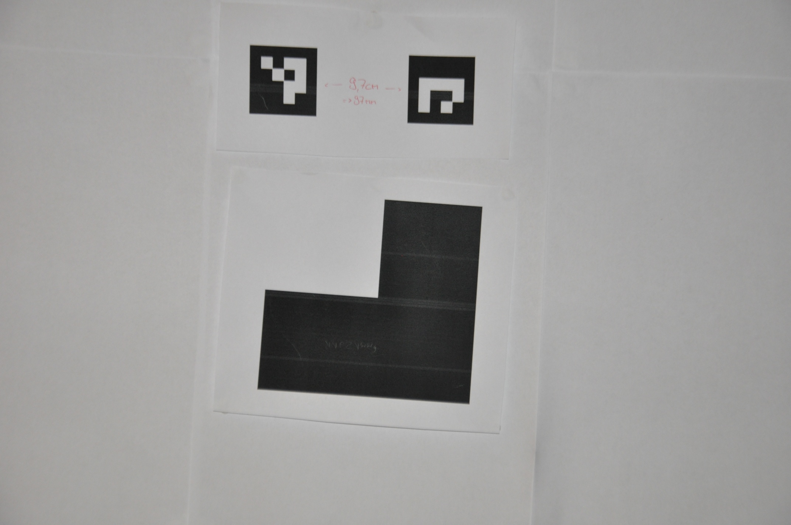
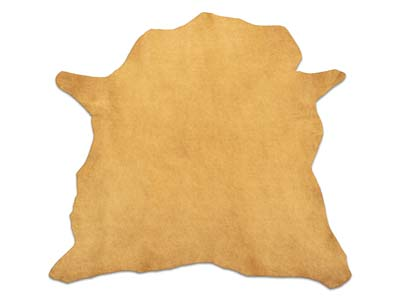
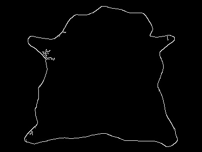
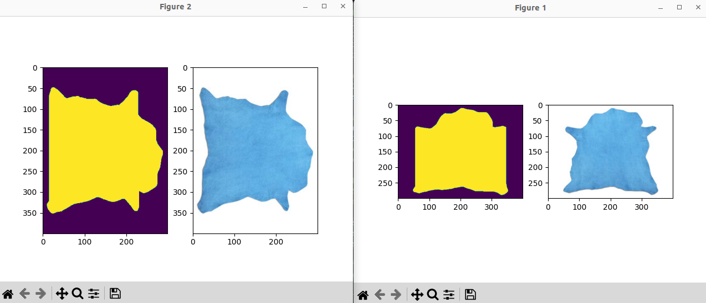
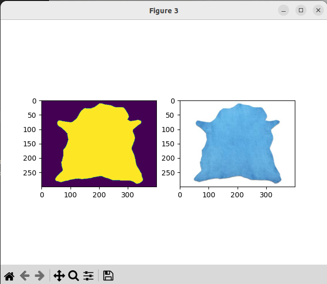

# Project: Leather skin size measurement

In this project I'll try to implement a script which is able to measure the size of a cows leather skin from a simple picture. With basic knowledge about pyhton and image processing with OpenCV I hope to learn about both in the process.

At the moment I'm able to calculate the area of simple shapes like a DIN A4 sized "L" with the accuracy of 99.7% (from about 1.5m distance). Future tests with random shapes or actual leather skins have yet to be done. 

## Dependencies
Linux OS (Ubuntu) with the following packages and Python modules (TBC):

* opencv-python: Edge detection and  ArUco markers
* gphoto2: Operating the DSLR camera via USB
* matplotlib: visualization of matrix modifications 

## Approach
The first step is to calibrate the camera. This is necessary to understand how far away the measurment plane is and how much surface area each pixel of the captured image is representing. 
To do this, I'm using OpenCV and the underlaying ArUco markers. A Nikon D90 is pointed to the desired measuring plane and controlled via gphoto2 on Ubuntu. After placing two ArUco markers next to each other with a known distance inbetween them, I'm able to calculate the "pixel-distance" from one to another within the captured image. Correlating the distance in pixels with the real world distance in mm allows the determination of a pixel "length" (and area). 

Once the calibration is done, the markers can be swapped by the measurement object. At this point, it has to have a notable contrast difference compared to the background to ensure a flawless edge detection by OpenCV.

I will then transform the result of the edge detection into a 2D-Array to enable the area calculation. This is achieved by detecting the pixels which are located inbetween two edges (beside some edge cases).
The final step is to count all the recored pixels and to multiply this sum with the area of one pixel to get the total surface area.

The measurement accuracy depends on multiple factors: 
 * Quality of the picture (brightness, sharpness)
 * Calibration accuracy 
 * Cleanliness of the measurement objects edges
 * Contrast of measurement object

## Image Processing
Following chapters will show the processing with example pictures of a simple "L" shape. Since I'm currently still in a testing phase, I have to use some workarounds with the hardware setup. Thats why I'm using my apartments door as a temporary measurement plane. In the future the camera should be mounted to the ceiling and point to the floor.

### Calibration
Example of a alibration image with two ArUco markers:

Applying OpenCV ArUco detection and plotting a rectangular triangle between them: 

The blue triangle visualizes the distance calculation with basic trigonometry. From this distance the pixel size can be easily derived.

### Area measurement
After the markers are removed, an image of the measurement object is captured. For the following example I used this random picture from [Google](https://www.cooksongold.de/Schmuckwerkzeuge/Werkbrettfell-Aus-Leder-prcode-999-6831?gclid=CjwKCAjwzY2bBhB6EiwAPpUpZl-n1pS2YaUeO1OwHV_3LIabFakzaTOhXcqLAViDNeC_q7Le-j1D1RoC03oQAvD_BwE&gclsrc=aw.ds) since it will represent the results more distinct than the "L".
Applying the OpenCV edge detection leads to:

For the area calculation, I wrote a very basic algorithm which detects the pixels inbetween two edges. Every pixel within the edges is marked in a 2D Array with the m x n size of the original image. Since this method will mistakenly mark pixels between overlapping edges aswell, the edged image is rotated by 90 degree and again scanned for pixels between the edges:

By overlaying the two resulting arrays, the mistakenly marked pixels can be sorted out leaving behind a pixel map of the leather skin area:

The amount of pixels within the skin area (yellow) can now be counted to mulitply the sum with the pixel size from the calibration (not in this example, since the leather image is from the internet). This will result in the overall area of the skin.

